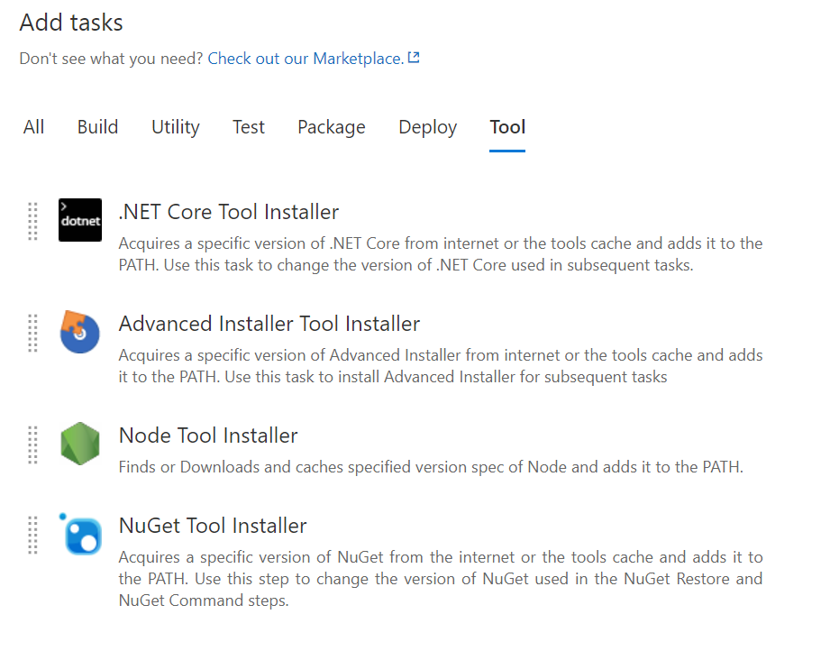
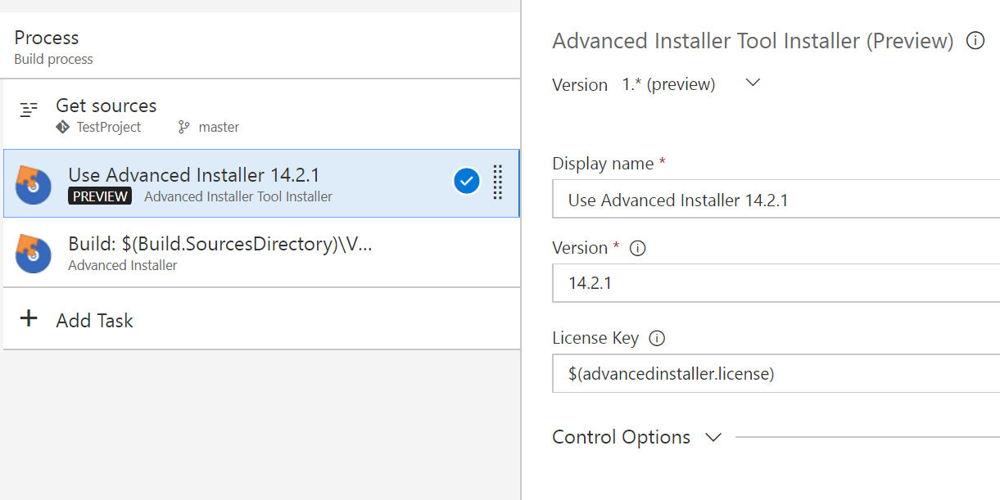
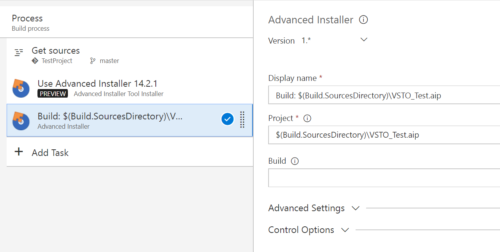

# Advanced Installer Tool Installer

Acquires a specific version of Advanced Installer from internet or the tools cache and adds it to the PATH. Use this task to install Advanced Installer for subsequent tasks.

This is a [Tool Installer](https://www.visualstudio.com/en-us/docs/build/concepts/process/tasks#tool-installers) extension. To use this capability you must be working on Team Services and enable the **Task tool installers** [preview feature](https://www.visualstudio.com/en-us/docs/collaborate/preview-features) for your account.

# How to use 

This installer task is designed to work in tandem with the [Advanced Installer Build Task](https://marketplace.visualstudio.com/items?itemName=caphyon.AdvancedInstaller-BuildTask). You have thus complete support for building Advanced Installer projects from Team Services.

