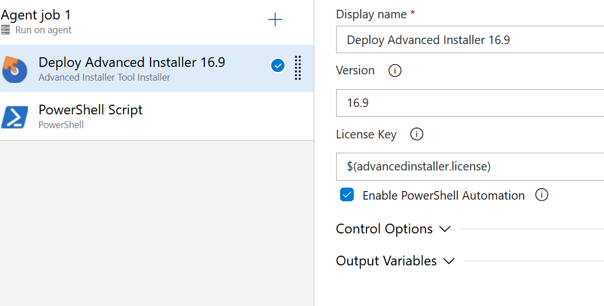

# Advanced Installer Tool Installer

Acquires a specific version of Advanced Installer from internet or the tools cache and adds it to the PATH. Use this task to install Advanced Installer for subsequent tasks.

# How to use 

This installer task should be used when building a solution that contains a [Visual Studio Advanced Installer project](https://www.advancedinstaller.com/user-guide/ai-ext-vs-project.html).

